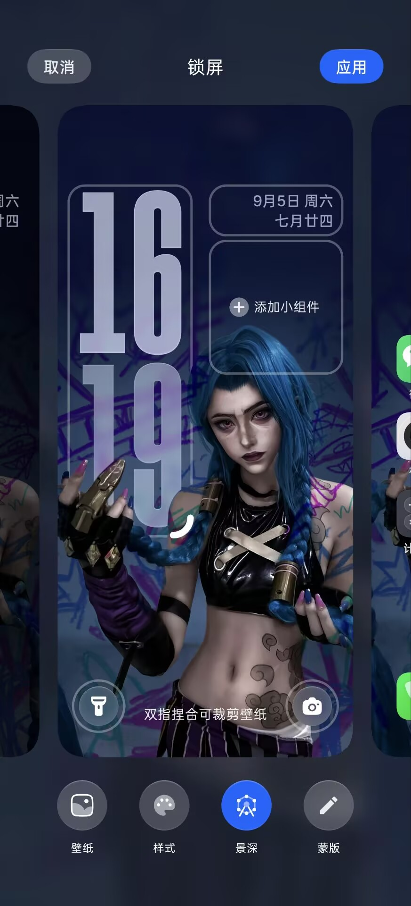
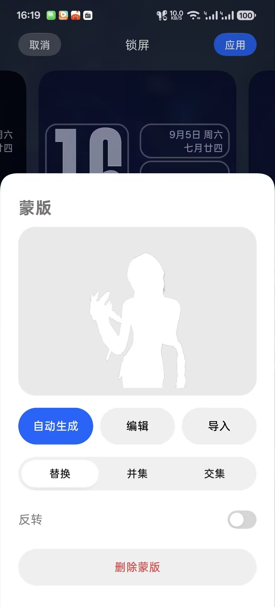

# ColorOSDepthMask

ColorOSDepthMask 是一个用于 **ColorOS 锁屏景深壁纸** 的 LSPosed 模块。

它可以让你自己控制景深蒙版，不再只能依赖系统 AI 自动抠图。

## 实际界面

<table>
  <tr>
    <td align="center" width="33%">
      <a href="screenshots/lockscreen-editor.jpg"></a><br>
      <sub>锁屏编辑页：在原生「景深」旁加入「蒙版」入口</sub>
    </td>
    <td align="center" width="33%">
      <a href="screenshots/mask-panel.jpg"></a><br>
      <sub>蒙版面板：自动生成、编辑、导入，以及替换 / 并集 / 交集 / 反转</sub>
    </td>
    <td align="center" width="33%">
      <a href="screenshots/mask-editor.jpg"></a><br>
      <sub>蒙版编辑器：直接在真实壁纸上使用画笔、橡皮、撤销和重做</sub>
    </td>
  </tr>
</table>

## 有什么用

你可以：

- 在 ColorOS 锁屏壁纸编辑页直接打开 **蒙版** 功能；
- 调用 ColorOS 自带 AI 自动生成景深蒙版；
- 在真实壁纸上手工修改蒙版；
- 导入自己制作的 PNG 蒙版；
- 使用画笔 / 橡皮、撤销 / 重做、缩放和平移继续修边；
- 每张壁纸单独保存自己的蒙版；
- 手动控制景深开关；
- 保存后立即刷新最新景深预览，不先闪回旧蒙版；
- 最终应用时使用当前最新的自定义蒙版，而不是旧的 AI 结果或之前缓存的旧结果。

独立 App 还可以：

- 查看当前版本、ColorOS、Wallpapers、Root 等信息；
- 一键重载 Wallpapers / SystemUI；
- 检查 GitHub Release 更新并下载安装；
- 一键复制诊断信息；
- 打开项目仓库、Releases、Issues 和开发者 Blog。

## 兼容环境

目前主要适配：

- ColorOS 16
- Android 16
- `com.oplus.wallpapers` 16.10.x
- LSPosed
- KernelSU / KernelSU Next / Magisk / APatch 等 Root 环境

系统或 Wallpapers 更新后，内部实现可能变化，因此可能需要重新适配。

## 安装

1. 从 Releases 下载最新版 APK：  
   <https://github.com/canxin121/ColorOSDepthMask/releases>

2. 安装 APK。

3. 在 LSPosed 中启用 **DepthMask**。

4. 作用域只选择：

   ```text
   com.oplus.wallpapers
   ```

5. 打开 DepthMask App，授予 Root 权限。

6. 点击首页里的 **重载壁纸**，让 Wallpapers 重新加载 Hook。

## 怎么用

### 自动生成蒙版

1. 打开 ColorOS 锁屏壁纸编辑页。
2. 选择一张支持景深的壁纸。
3. 点击底部的 **蒙版**。
4. 点击 **自动生成**。
5. 等待 ColorOS AI 生成蒙版。
6. 生成后可以继续手工编辑。
7. 点击保存。
8. 手动开启 **景深**。
9. 点击 **应用**。

### 编辑已有蒙版

1. 点击 **蒙版**。
2. 点击 **编辑**。
3. 使用画笔或橡皮修改。
4. 双指缩放 / 平移查看细节。
5. 点击保存。

保存后景深预览会自动刷新到最新蒙版，不需要退出 Wallpapers，也不会先显示旧蒙版再跳变。

### 导入 PNG 蒙版

1. 点击 **蒙版**。
2. 点击 **导入**。
3. 选择 PNG 文件。
4. 保存后手动开启景深。
5. 点击应用。

PNG 推荐和原始壁纸保持相同尺寸 / 比例。

蒙版规则：

- 白色 / 不透明：前景
- 黑色 / 透明：背景
- 灰色 / 半透明：过渡区域

## 蒙版模式

保存蒙版后可以选择：

- **替换**：只使用自定义蒙版；
- **并集**：自定义蒙版 + 系统结果；
- **交集**：只保留两者重合部分；
- **反转**：前景和背景互换。

一般直接使用 **替换** 即可。

## 独立 App

App 有三个页面：

### 首页

用于：

- 查看当前版本；
- 检查更新；
- 查看 Root 状态；
- 重载 Wallpapers；
- 重载 SystemUI。

### 诊断

用于查看设备和模块信息。

遇到兼容性问题时，可以直接点击 **复制全部诊断信息**，再提交到 Issues。

### 项目

可以打开：

- GitHub：<https://github.com/canxin121>
- Blog：<https://blog.cxits.cn/>
- 项目仓库：<https://github.com/canxin121/ColorOSDepthMask>
- Releases：<https://github.com/canxin121/ColorOSDepthMask/releases>
- Issues：<https://github.com/canxin121/ColorOSDepthMask/issues>

## 遇到问题

如果出现：

- 蒙版按钮没有出现；
- 景深开关显示开启，但实际没有效果；
- 保存后最终锁屏和预览不一致；
- 系统更新后功能失效；

请先：

1. 确认 LSPosed 模块已启用；
2. 确认作用域是 `com.oplus.wallpapers`；
3. 在 DepthMask App 里执行一次 **重载壁纸**；
4. 如果仍有问题，到诊断页复制完整诊断信息并提交 Issue。

Issues：  
<https://github.com/canxin121/ColorOSDepthMask/issues>
